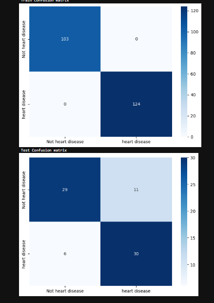
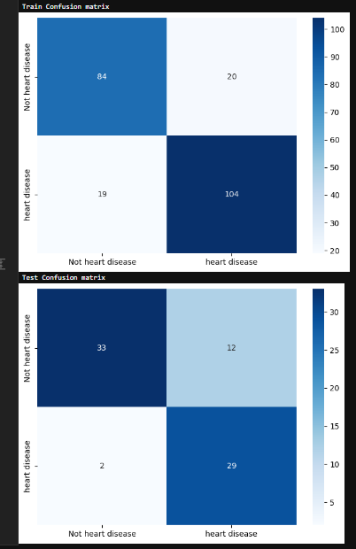
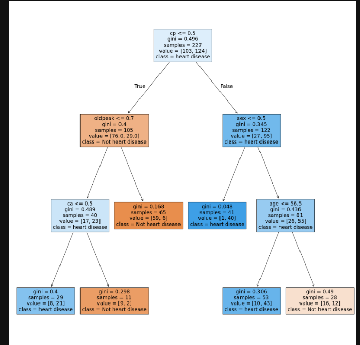

#  Pruning Decision Trees for Enhanced Model Performance

This project demonstrates how **Decision Tree pruning** can improve model performance, reduce overfitting, and enhance generalization in classification tasks.  
The dataset used is the **Heart Disease UCI dataset** (`heart.csv`), which contains various clinical parameters to predict the presence of cardiac disease.  

The notebook explores the impact of **pre-pruning and post-pruning techniques** on model accuracy, recall, and interpretability.

---

##  Objective

The main objectives of this project are:
- To understand the importance of pruning in Decision Trees  
- To compare model performance **before and after pruning**  
- To visualize changes in correlation and tree structure  
- To ensure improved generalization without significant accuracy loss  

---
##  Folder Structure

```bash
Pruning-Decision-Tree/
│
├── Pruning Decision Tree.ipynb                    # Jupyter Notebook for model development and pruning process
├── Grahical_results_prune_DT/
│   ├── Correlation_Matrix_After_pruning.png       # Correlation heatmap after pruning
│   ├── Correlation_Matrix_before_Pruning.png      # Correlation heatmap before pruning
│   └── Pruned_DT.png                              # Visualization of the pruned decision tree
├── heart.csv                                      # Heart Disease dataset used for training and testing
└── README.md                                      # Project documentation file
```
---
##  Dataset Overview

The dataset (`heart.csv`) consists of several medical features that help predict heart disease likelihood.  
Key attributes include:

- **Age** – Patient’s age  
- **Sex** – Gender (1 = male, 0 = female)  
- **Chest Pain Type (cp)** – Type of chest pain  
- **Resting Blood Pressure (trestbps)** – mm Hg  
- **Cholesterol (chol)** – Serum cholesterol in mg/dl  
- **Maximum Heart Rate (thalach)** – Achieved maximum heart rate  
- **Target** – Indicates disease presence (1 = yes, 0 = no)  

---

##  Model Workflow

1. **Data Loading and Preprocessing**  
   - Handled missing and categorical values  
   - Scaled continuous features for balanced training  

2. **Model Building (Before Pruning)**  
   - Built a Decision Tree with default parameters  
   - Observed overfitting with high training accuracy  

3. **Model Pruning (After Optimization)**  
   - Applied cost complexity pruning using `ccp_alpha`  
   - Selected the best alpha value based on validation scores  

4. **Performance Comparison**  
   - Compared Accuracy, Recall, Precision, and F1-score before and after pruning  

---

## Visual Results

### 1. Correlation Matrix – Before Pruning


### 2. Correlation Matrix – After Pruning


### 3. Visualization of Pruned Decision Tree



---

##  Key Insights

- **Before pruning:** The tree model tends to overfit, capturing noise and complex branches.  
- **After pruning:** Simplifies decision paths, improves model interpretability, and enhances Recall.  
- **Overall impact:** A pruned model maintains strong predictive power with less complexity.  

---

##  Tools & Technologies

- **Programming Language:** Python 3.10+  
- **Environment:** Jupyter Notebook  
- **Libraries Used:**
  - `pandas`
  - `numpy`
  - `matplotlib`
  - `seaborn`
  - `scikit-learn`
  - `graphviz` (for tree visualization)

---

##  Conclusion

Pruning helps prevent overfitting by reducing unnecessary branches, leading to a simpler and more interpretable model.  
Although a small reduction in training accuracy is observed, the **validation and generalization performance improve**, making pruning essential for reliable real-world predictions.

This project highlights how **cost complexity pruning** enhances model robustness and interpretability — crucial for sensitive domains like healthcare prediction.

